## The *Flashback '94 Shader Pack* for Unity

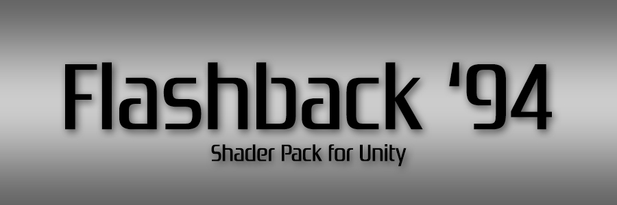

### :warning: This version targets [Unity 2017.3.0f3](https://unity3d.com/unity/whats-new/unity-2017.3.0) :warning:

## IMPORTANT NOTE

I've removed this shader pack from the Unity Asset Store and placed it here for two reasons:

First of all, I simply don't have enough spare time to maintain it, and it didn't feel right to keep promoting it as a product, even a free one.

But more importantly, and this part will be more relevant to you, Unity's [scriptable render pipeline](https://docs.unity3d.com/Manual/ScriptableRenderPipeline.html) signals a shift away from the paradigm that these shaders were initially written to support. This is neither good nor bad, it's just the way software evolves.

However, because *Flashback '94* calculates lighting in the vertex shader instead of the pixel shader for maximum authenticity (read: delightful ugliness), it only works with the built-in legacy pipeline, which means that its shelf life has become very short. In fact, Unity [doesn't support per-vertex lighting on consoles](https://docs.unity3d.com/Manual/RenderingPaths.html) anyway.

In theory, it should be possible to recreate this using the scriptable pipeline, but that task is a little too big to justify spending my nights and weekends on it, especially when my day job involves being knee-deep in Unreal instead of Unity. The mental context switch is just a bit much to ask after a full workday.

So, if anyone would like to use my shaders as a starting point for that project, please go ahead!

All I ask is that you add a little 'thank you' in there somewhere. My ego, she craves validation.

:heart: **George Kokoris (Burning North)**

## Features

The *Flashback '94 Shader Pack* for Unity is a collection of shaders and scripts that emulate the graphical limitations of game consoles from the 1990s.

### Affine Texture Mapping

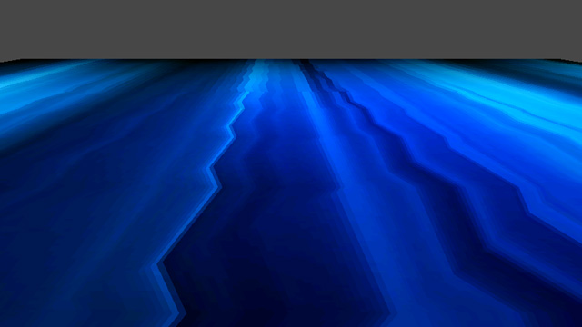

To improve performance when rendering triangles, older graphics hardware didn't correct textures for perspective. Instead, it just distorted them in two dimensions to fit the onscreen shape of each triangle. This saved a lot of number-crunching, but it caused textures to warp when viewed at an angle, producing a telltale 'zigzag' effect on floors and walls.

### Limited Vertex Precision

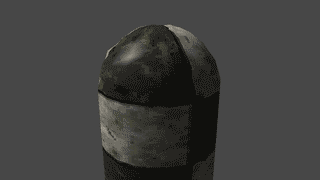

Although most early graphics processors could use fixed-point or floating-point math (numbers with decimal places), some consoles were only able to pass integer values (whole numbers) from one component to another. This meant that each vertex in a 3D model would 'snap' to its nearest integer position instead of moving smoothly, resulting in a weird gelatinous effect as the vertices all 'snapped' independently of each other.

### Limited Resolution and Color

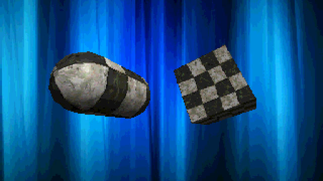

Your fancy-pants gaming PC can render 18 gorillion colors in 4K resolution at 144 frames per second, but not even the most beastly of 90s consoles could manage such epoch-defining feats of computation. Most consoles rendered 3D graphics at a very small resolution like 320x240 and upscaled it to fit a TV screen. On top of that, they had to use fewer bits to store color information, which limited color precision and caused those 'banding' artifacts that opposing tribes of brand devotees used to get into gigantic flame wars over.

Haha, isn't it great how we don't have flame wars anymore?

## Instructions

When you add the *Flashback '94 Shader Pack* to your Unity project, you'll see some new folders in your Assets window:

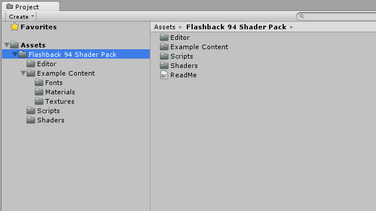

- **Editor** - the custom editor properties for the image effect script.
- **Example Content** - example content, which you may have gathered from the fact that it's named 'Example Content'.
- **Scripts** - the image effect script that can be attached to a camera in your scene.
- **Shaders** - all the object, projector, and image effect shaders.

### Object Shaders

If you want to apply one of these shaders to an object, first create a material, then go to its shader dropdown and select a shader from **Flashback 94/Object Shader**.

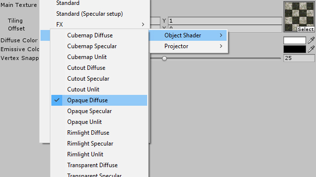

The possible shaders are:

- **Cubemap (Diffuse/Specular/Unlit)** - shaders that apply an environment map over a diffuse texture.
- **Cutout (Diffuse/Specular/Unlit)** - shaders that only draw pixels with an opacity above a cutoff value.
- **Opaque (Diffuse/Specular/Unlit)** - shaders that draw solid objects with diffuse textures.
- **Rimlight (Diffuse/Specular/Unlit)** - shaders that draw solid objects with diffuse textures, then move, scale, and tint the back faces to create the illusion of rim lighting.
- **Transparent (Diffuse/Specular/Unlit)** - shaders that draw transparent objects with diffuse textures.
- **UI Overlay** - shader that draws unlit, alpha-blended UI elements that remain visible even when occluded.

All *Flashback '94* object shaders use affine texture mapping, and they all have a **Vertex Snapping** attribute that determines how aggressively the individual vertices 'snap' when moving. The other shader attributes are named according to what they do, and behave in much the same way as Unity's built-in legacy shaders.

### Projector Shaders

New in version 2.0 are two shaders for use with Unity's projector system. Because per-vertex rendering doesn't support real-time shadows, using a projector to create a blob shadow is the only way to ground characters and dynamic objects in the environment. Simply create a material using one of the **Flashback 94/Projector** shaders, and add it to the **Material** attribute of a [Projector](https://docs.unity3d.com/Manual/class-Projector.html) object.

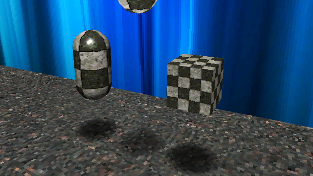

The two shaders are:

- **Multiply (Shadows)** - a shader that multiplies the color of the target surface by the color of the projected image. This is perfect for blob shadows. For best results, use a projected texture with a **white** background.
- **Additive (Lights)** - a shader that adds the projected image color to the target surface. Great for flashlights or anything that should brighten a surface. For this one, projected textures should have a **black** background.

For both shaders, the projected texture should have its **Texture Type** attribute set to 'Advanced' and its **Wrap Mode** set to 'Clamp'. The mip maps that Unity automatically generates can cause visual artifacts with projectors, so either enable **Border Mip Maps** or just disable **Generate Mip Maps** entirely.

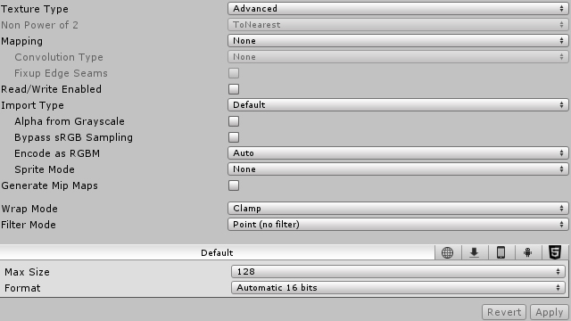

Both shaders support falloff textures, so you can use a horizontal gradient to vary the strength of the projector by distance. Intensity is based on grayscale value (white is full strength, black is off), so the color of the gradient doesn't matter.

They also have a **Vertex Snapping** attribute, which **must be the same** as the target surface to prevent clipping artifacts.

Projectors in Unity can be tricky to get right, so if you want to see a correct implementation, just take a look at the **Example_BlobShadow** material in the **Example Content/Materials** directory.

### Image Effect

To add the image effect to your scene, simply select your main camera, click **Add Component** in the inspector, then choose **Flashback 94** and **Post Process**.

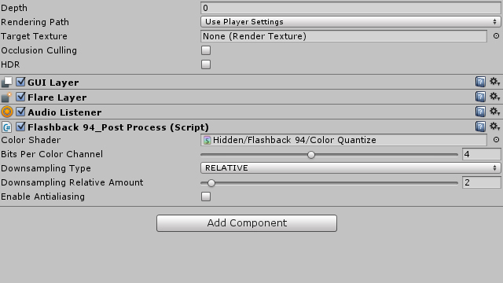

You can use the **Bits Per Color Channel** slider to adjust the color depth of the camera, and the **Downsampling Type** dropdown to choose how you want to scale the framebuffer:

- **NONE** - does nothing. Use this if you just want to mess with the color bits slider.
- **RELATIVE** - divides the window size by an integer and draws to a buffer of that size.
- **ABSOLUTE** - draws to a buffer of the size you specify, from 32x32 to 1920x1920.

The **Enable Antialiasing** checkbox lets you decide whether the framebuffer should be antialiased during resizing. Switch it off for that authentic 'pixels so big you could park a cyberpunk police gunship on them' look.

### Example Scene

The **Example Content** folder contains a scene that implements most of the features in this shader pack. Feel free to play with the example materials to see how they work.

## Best Practices

Surprisingly - even to me, and I *made* the friggin' thing - the shortcomings of this shader pack are similar to those of the original hardware, and require similar workarounds.

Firstly and most importantly, these shaders all began their lives as [open-source Cg implementations](http://wiki.unity3d.com/index.php/CGVertexLit) of Unity's built-in 'VertexLit' shader. The per-vertex lighting model was invented by Celtic druids in 2200 BC and therefore comes with a few caveats:

- Vertex-lit shaders will *not* work on modern consoles, but they *will* work just fine on iOS/Android and any PC/Mac/Linux computer recent enough not to use punch cards.

- These shaders *cannot* cast or receive real-time shadows, as this would require per-pixel lighting. You *can*, however, get around this by using the included projector shaders to create blob shadows. Or, if you're a wizard, you can add your own *Quake 2*-style  geometric projection shadows and leave a passive-aggressive note implying that I'm lazy and/or stupid for not including them myself.

- They *cannot* be lit by more than 8 lights at a time. Your scene can have more lights in it, of course, but an object with one of these shaders applied will only receive lighting from [the 8 brightest ones nearby](https://docs.unity3d.com/Manual/SL-UnityShaderVariables.html) (scroll to the section on the *Vertex* pass type). Every per-vertex lighting model has a constraint like this, so if Hideo Kojima could live with it, then so can you.

- Unity does not provide light position data when rendering lightmapped objects, so if you use lightmaps with these shaders, you won't get any specular highlights.

Another thing to keep in mind is the quirky way that affine texture mapping works. If you're looking directly at a surface, it's fine, but if the camera is at a shallow enough angle, the texture will turn into a Stanley Kubrick slit-scan acid trip.

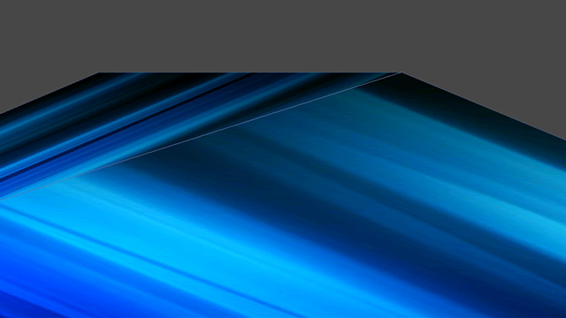

The way to get around this is the same as it was in the 90s: always make sure any large flat surfaces are subdivided into a grid. The sampling gets less accurate the further it gets from a vertex, so adding more vertices will ease the pain. Yes, you're technically adding more polygons where you don't need them, but if that turns out to be a performance bottleneck, then you're probably developing for 90s hardware anyway.

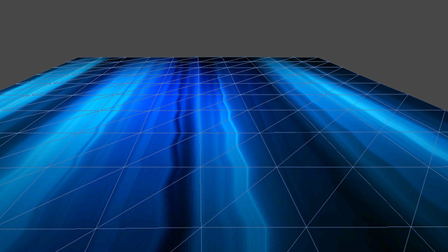

Other workarounds include designing your textures so that any straight lines lie on polygon edges, where the distortion is least severe. You may want to consider creating separate geometry for especially critical details, which is how things like road lines were done in many racing games.

Finally, always make sure that any textures you're using with these shaders have their **Filter Mode** property set to 'Point'. This will ensure they have that crisp, pixelated look that graphics researchers once spent years of their lives trying to eliminate. Guess the joke's on them, huh?

## Gratitude

Other people who made this possible:

- The mysterious 'Ilya.s' on the Unify Community Wiki, whose [CGVertexLit shader](http://wiki.unity3d.com/index.php/CGVertexLit) laid the groundwork for my horrible crimes against sanity and computer graphics.
- My former employers at [Failbetter Games](http://www.failbettergames.com/), who graciously allowed me to develop and sell this shader pack in my spare time during the development of *Sunless Sea*.

Now what are you still doing here? Go make your elders proud!
